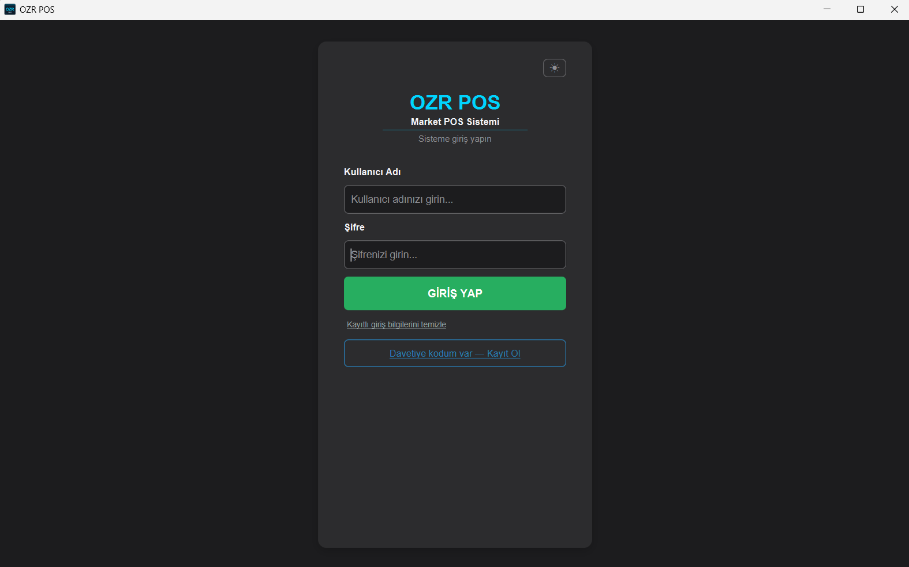
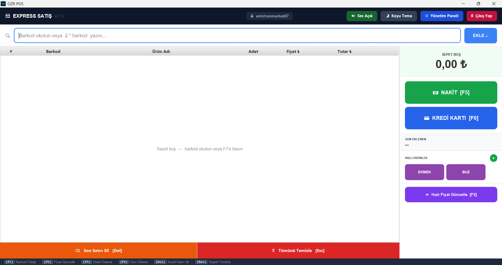
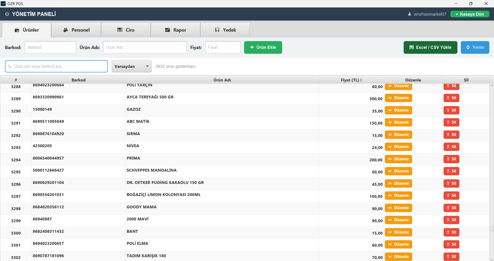
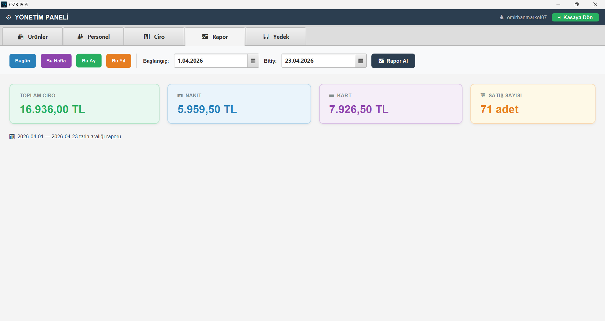
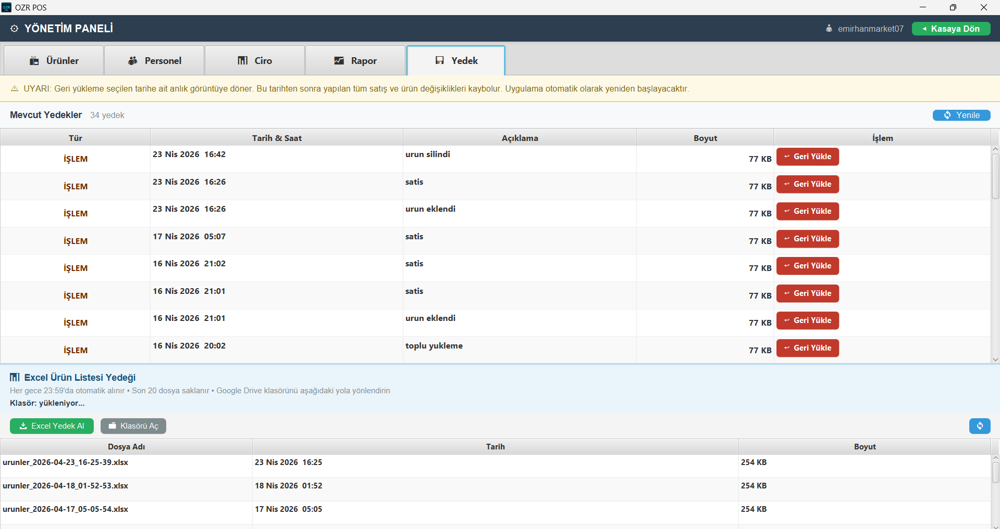

# OZR POS — Market Satış Noktası Sistemi

Küçük ve orta ölçekli marketler için geliştirilmiş, **güvenli**, **hızlı** ve **internet bağlantısı gerektirmeyen** masaüstü POS yazılımı.

> A secure, offline-first Point of Sale system for small retail stores. Built with Spring Boot + JavaFX — no internet required for daily operations.

[](https://github.com/EmirhanOzer07/OZR_pos/actions/workflows/ci.yml)


---

## Neden OZR POS?

- **İnternet gerektirmez** — Kesintisiz satış, bağlantı bağımsız çalışır
- **Kurulum kolaylığı** — Java yüklemenize gerek yok, tek klasör açıp çalışır
- **Verileriniz sizde** — Tüm veriler şifreli olarak kendi bilgisayarınızda saklanır
- **Otomatik yedekleme** — Her gün otomatik yedek, tek tıkla geri yükleme
- **Otomatik güncelleme** — Yeni sürümler arka planda indirilir, elle müdahale gerekmez
- **Çoklu kullanıcı** — Admin ve kasiyer rolleriyle personel yönetimi

---

## Ekran Görüntüleri

### Giriş Ekranı


### Kasa / Satış Ekranı


### Ürün Yönetimi


### Satış Raporları


### Yedekleme Sistemi


---

## Özellikler

- **Satış & Kasa** — Barkod okuyucu desteği, sepet yönetimi, nakit/kart ödeme, klavye kısayolları
- **Ürün Yönetimi** — Tekil ekleme veya CSV ile binlerce ürünü toplu yükleme
- **Personel Yönetimi** — `ADMIN` ve `KASIYER` rolleri, şifre değiştirme
- **Satış Raporları** — Günlük/dönemsel ciro, nakit-kart ayrımı
- **Otomatik Yedekleme** — Her açılışta SQL yedeği + her gece 22:00'de Excel ürün listesi
- **Geri Yükleme** — Son 30 yedekten tek tıkla geri dönüş
- **Lisans Yönetimi** — Market bazında bitiş tarihi, uygulama içi uyarı
- **Otomatik Güncelleme** — GitHub Releases üzerinden yeni sürüm tespiti ve kurulum
- **Karanlık / Aydınlık Tema** — Kullanıcı tercihine göre değiştirilebilir

---

## İndirme ve Kurulum

> **Uygulamayı kullanmak için lisans ve davetiye kodu gereklidir.**
> Almak için aşağıdaki iletişim bilgilerinden ulaşın.

**Sistem Gereksinimi:** Windows 10/11 (64-bit) — Java kurulumu gerekmez

### Kurulum Adımları

1. [Releases](https://github.com/EmirhanOzer07/OZR_pos/releases/latest) sayfasından `OZRPos-vX.Y.Z.zip` dosyasını indirin
2. ZIP'e sağ tıklayın → **Tümünü Çıkar** → `C:\OZRPos` klasörüne taşıyın
3. `OZRPos.exe`'ye sağ tıklayın → **Masaüstüne kısayol oluştur**
4. Kısayoldan uygulamayı açın → **Kayıt Ol** → davetiye kodunuzu girin
5. Market adı, kullanıcı adı ve şifrenizi belirleyin — kurulum tamamdır

### Sonraki Güncellemeler

Uygulama her açılışta yeni sürüm olup olmadığını otomatik kontrol eder. **Tekrar ZIP indirmenize gerek yoktur.**

> ⚠️ **Kurulum Yeri:** ZIP dosyasını `C:\Program Files\` içine **KURMAYIN**.
> Masaüstü veya `C:\OZRPos\` gibi bir klasöre çıkartın.
> Program Files'a kurulum otomatik güncellemeyi engeller.

> ⚠️ **Windows Güvenlik Uyarısı:** `OZRPos.exe` ilk çalıştırmada
> *"Windows bilgisayarınızı korudu"* uyarısı gösterebilir.
> **"Daha fazla bilgi"** → **"Yine de çalıştır"** adımlarını izleyin.

---

## Sık Sorulan Sorular

**İnternet bağlantısı şart mı?**
Hayır. Günlük satış işlemleri için internet gerekmez. İnternet yalnızca otomatik güncelleme sırasında kullanılır.

**Verilerim nerede saklanıyor?**
Tüm veriler kendi bilgisayarınızda, AES-256 şifreli H2 veritabanında saklanır. Hiçbir veri dışarıya gönderilmez.

**Birden fazla kasa kullanılabilir mi?**
Hayır, uygulama tek bilgisayar için tasarlanmıştır.

**Barkod okuyucu gerekli mi?**
Hayır. Barkod manuel olarak yazılabilir. Barkod okuyucu kullanmak işlemleri hızlandırır.

**Kaç ürün eklenebilir?**
Pratikte sınır yoktur. CSV ile toplu yüklemede tek seferde 10.000 ürün desteklenmektedir.

**Lisansım dolunca ne olur?**
Uygulama içinde uyarı verir. Yenileme için iletişime geçin.

**Bilgisayar bozulursa verilerimi kurtarabilir miyim?**
Evet. Otomatik yedekler `AppData\Local\MarketPOS\yedek\` klasöründe tutulur. Bu klasörü düzenli olarak USB'ye kopyalamanız önerilir.

---

## Veri Güvenliği

> 🔑 **Önemli:** İlk kurulumdan sonra `AppData\Local\MarketPOS\yedek\dbkey.bak` dosyasını bir USB belleğe yedekleyin.
> Bu dosya tüm verilerinizin şifreleme anahtarıdır. Kaybolursa veriler **kalıcı olarak erişilemez** hale gelir.

---

## Yedekleme Takvimi

| Tetikleyici | Tür | Saklama |
|-------------|-----|---------|
| Her açılışta (bugün yoksa) | SQL yedek (.zip, şifreli) | Son 30 dosya |
| Her gece 22:00 | Excel ürün listesi (.xlsx) | Son 20 dosya |
| Yönetim paneli → Yedek Al | SQL veya Excel | — |

---

## İletişim / Contact

Lisans, davetiye kodu ve teknik destek için:

**E-posta:** emirhann0077@gmail.com

---

## Güvenlik Mimarisi

```
HTTP Request
    │
    ├─► RateLimitFilter     (Bucket4j — 10 req/min per IP on /api/auth/**)
    │
    ├─► JwtFilter           (HMAC-SHA256 token validation, SecurityContext population)
    │
    ├─► SecurityFilterChain (Spring Security — stateless, CSRF disabled)
    │
    ├─► MarketFilterAspect  (AOP — injects Hibernate @Filter before every
    │                         repository call; enforces row-level tenant isolation)
    │
    └─► Controller → Service → Repository
```

| Katman | Uygulama |
|--------|----------|
| Veritabanı | AES-256 şifreleme (`CIPHER=AES`, per-install key) |
| Kimlik doğrulama | JWT — HMAC-SHA256, kara liste desteği |
| Şifreler | BCrypt hashing |
| Çok kiracılılık | Hibernate `@Filter` ile satır düzeyinde izolasyon |
| Hız sınırlama | IP başına dakikada 10 istek |
| Yetkilendirme | Spring Security 6 + `@PreAuthorize` |
| SuperAdmin | Yalnızca localhost (`127.0.0.1`) erişimi |
| Denetim | Tüm giriş denemeleri ve kritik işlemler `[AUDIT]` prefix ile loglanır |
| Dosya yükleme | MIME tipi + uzantı + boyut doğrulaması |

---

## Teknoloji Yığını

| Katman | Teknoloji |
|--------|-----------|
| Backend | Spring Boot 3.3 |
| UI | JavaFX 21 |
| Veritabanı | H2 (AES-256 şifreli, gömülü) |
| Kimlik Doğrulama | JWT (HMAC-SHA256) |
| Şifre Hashleme | BCrypt |
| Hız Sınırlama | Bucket4j 8.10 (token bucket) |
| Önbellekleme | Caffeine Cache (30s TTL) |
| Excel Dışa Aktarım | Apache POI 5 |
| Test | JUnit 5 + Spring Boot Test (H2 in-memory) |
| Paketleme | jpackage (gömülü JRE, `.exe`) |

---

## Geliştirici Kurulumu

**Gereksinimler:** Java 21+ JDK, Maven 3.9+

```bash
git clone https://github.com/EmirhanOzer07/OZR_pos.git
cd OZR_pos
mvn package -DskipTests
java -jar target/pos-0.0.1-SNAPSHOT.jar
```

```bash
# Testleri çalıştır
mvn test
```

Hassas değerler (`JWT_SECRET`, `DB_KULLANICI_SIFRESI`) ilk çalıştırmada `%LOCALAPPDATA%\MarketPOS\config.properties` dosyasına otomatik üretilir. Kaynak kodda sır yoktur.

---

## Lisans

Copyright © 2026 Mustafa Emirhan Özer. Tüm hakları saklıdır.
Ticari kullanım için iletişime geçin: emirhann0077@gmail.com
