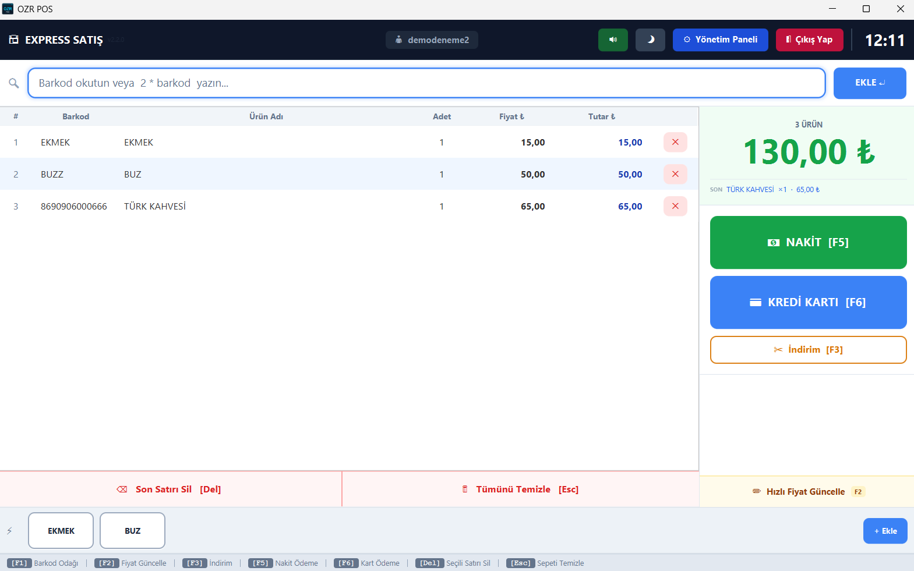
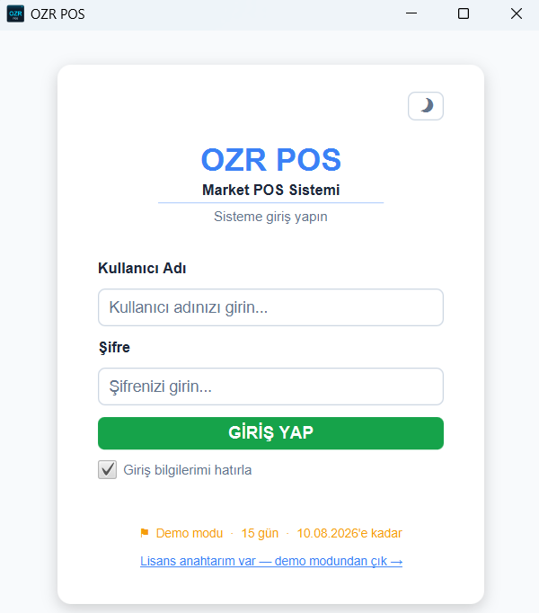
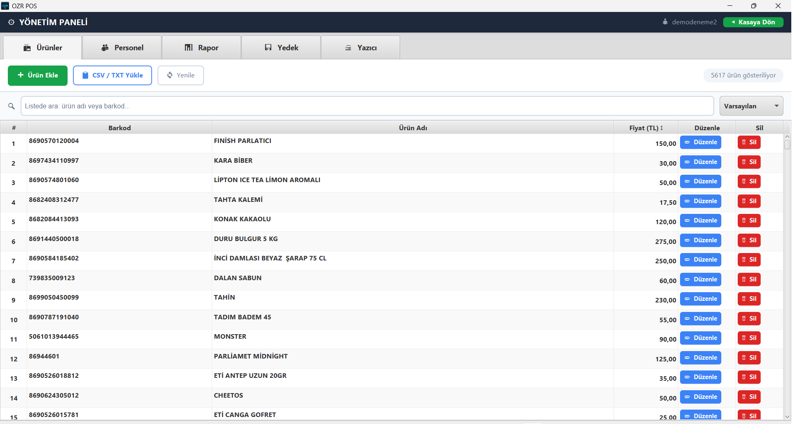
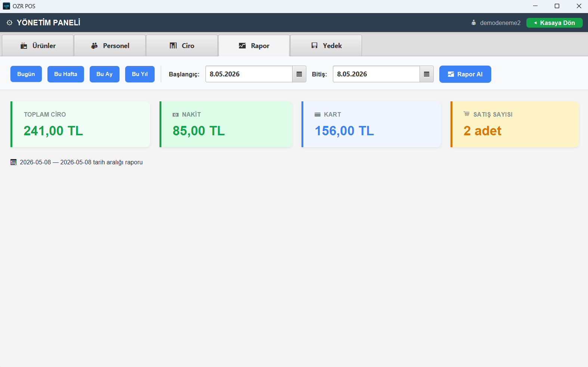
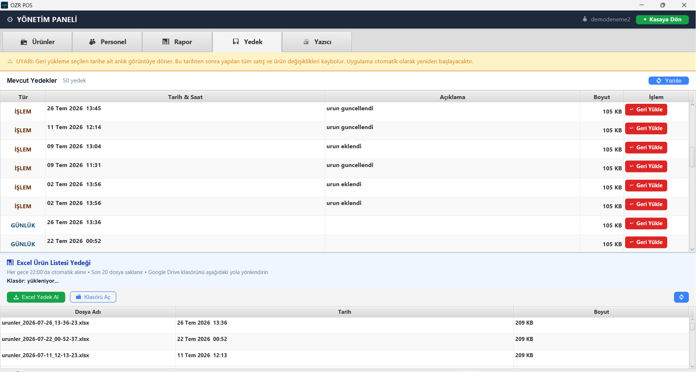
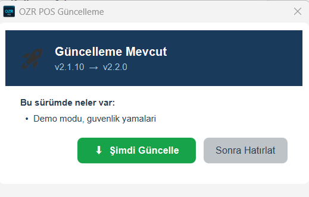
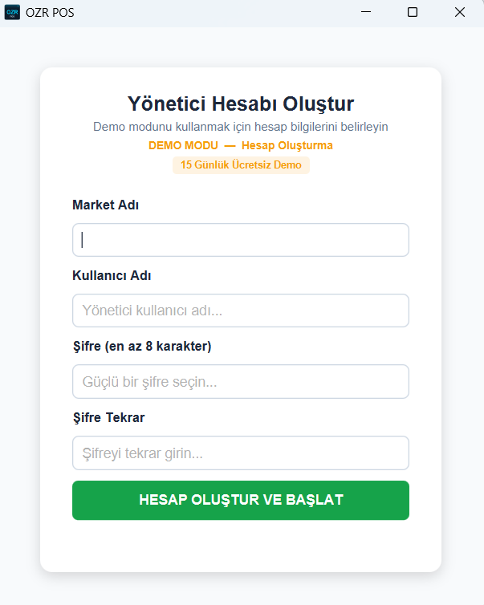

# OZR POS

**Profesyonel Market Kasa Sistemi · Professional Point of Sale System**

[**İndir / Download**](#kurulum) &nbsp;·&nbsp; [**Lisans Al / Get License**](#lisans-iletisim) &nbsp;·&nbsp; [**Yedek Rehberi / Backup Guide**](docs/YEDEK_REHBERI.md) &nbsp;·&nbsp; [**İletişim / Contact**](#lisans-iletisim)

---

> **TR** — Küçük ve orta ölçekli marketler için geliştirilmiş, güvenli, internet bağlantısı gerektirmeyen masaüstü kasa yazılımı. Tüm verileriniz şifrelenerek yalnızca kendi bilgisayarınızda saklanır.

> **EN** — A secure, offline-first desktop Point of Sale system for small and medium retail stores. No internet required for daily operations. Your data never leaves your computer.

---

## Ekran Görüntüleri / Screenshots

### Kasa / Satış Ekranı

Diğer ekranlar / More screenshots

### Giriş Ekranı

### Ürün Yönetimi

### Satış Raporları

### Yedekleme

### Otomatik Güncelleme

---

## Özellikler / Features

| | TR | EN |
|---|---|---|
| 🛒 Kasa | Barkod okuyucu, sepet yönetimi, nakit/kart ödeme, klavye kısayolları | Barcode scanner, cart, cash/card payment, keyboard shortcuts |
| 📦 Ürünler | Tekil ekleme veya CSV ile 10.000+ ürün yükleme | Single add or bulk CSV upload (10,000+ products) |
| 👥 Personel | ADMIN ve KASİYER rolleri, şifre değiştirme | ADMIN and CASHIER roles, password management |
| 📊 Raporlar | Günlük/dönemsel ciro, nakit-kart ayrımı | Daily/periodic revenue, cash-card breakdown |
| 💾 Yedekleme | Her açılışta otomatik SQL yedeği + gece Excel listesi | Auto SQL backup on launch + nightly Excel export |
| ♻️ Geri Yükleme | Son 30 yedekten tek tıkla geri dönüş | One-click restore from last 30 backups |
| 🔄 Güncelleme | Yeni sürümler arka planda indirilir, elle müdahale gerekmez | Updates download silently in the background |
| 🌙 Tema | Karanlık / Aydınlık tema | Dark / Light theme |
| 🔒 Güvenlik | AES-256 şifreleme, JWT kimlik doğrulama | AES-256 encryption, JWT authentication |

---

## 15 Günlük Ücretsiz Demo / 15-Day Free Trial

**TR:** İlk açılışta **"Demo Başlat"** butonuna tıklayın. 15 gün boyunca tüm özellikler tam olarak çalışır. Demo süresi dolduğunda lisans anahtarı ile aynı kurulumdan devam edin — verileriniz korunur.

**EN:** Click **"Start Demo"** on first launch. All features work fully for 15 days. After the trial, enter your license key to continue from where you left off — your data is preserved.

---

## Kurulum / Installation

**Gereksinimler / Requirements:** Windows 10/11 (64-bit) — Java kurulumu gerekmez / No Java required

### TR — Kurulum Adımları

1. [**Releases**](https://github.com/EmirhanOzer07/OZR-Pos/releases/latest) sayfasından `OZRPos-vX.Y.Z.zip` indirin
2. ZIP'e sağ tıklayın → **Tümünü Çıkar** → `C:\OZRPos` klasörüne taşıyın
3. `OZRPos.exe`'ye sağ tıklayın → **Masaüstüne kısayol oluştur**
4. Uygulamayı açın → **Demo** ile başlayın veya davetiye kodunuzu girin
5. Market adı, kullanıcı adı ve şifrenizi belirleyin — kurulum tamamdır

### EN — Installation Steps

1. Download `OZRPos-vX.Y.Z.zip` from the [**Releases**](https://github.com/EmirhanOzer07/OZR-Pos/releases/latest) page
2. Right-click ZIP → **Extract All** → move to `C:\OZRPos`
3. Right-click `OZRPos.exe` → **Send to → Desktop (create shortcut)**
4. Launch → start with **Demo** or enter your invitation code
5. Set store name, username, and password — done

> **⚠️ TR:** ZIP'i `C:\Program Files\` içine **KURMAYIN** — otomatik güncellemeyi engeller. `C:\OZRPos\` veya masaüstü kullanın.

> **⚠️ EN:** Do **NOT** install under `C:\Program Files\` — it blocks auto-updates. Use `C:\OZRPos\` or Desktop.

> **Windows SmartScreen:** "Daha fazla bilgi" → "Yine de çalıştır" / "More info" → "Run anyway"

---

## Lisans ve İletişim / License & Contact

### TR — Nasıl Lisans Alınır?

1. Uygulamayı kurun ve açın — 15 günlük ücretsiz demo otomatik başlar
2. Lisans satın almak için aşağıdaki adrese e-posta gönderin
3. Tarafınıza 8 karakterlik **davetiye kodu** iletilir
4. Kodu uygulamanın kayıt ekranına girin → marketiniz aktive edilir

> Lisanslar market başına satılmaktadır. Demo süresi boyunca tüm özellikler tam çalışır.

### EN — How to Get a License

1. Install and open the application — 15-day free demo starts automatically
2. Send an email to the address below to purchase a license
3. You will receive an 8-character **invitation code**
4. Enter the code on the app's registration screen → your store is activated

> Licenses are sold per store. All features work fully during the demo period.

| | |
|---|---|
| **Email / E-posta** | **emirhann0077@gmail.com** |
| **Yanıt Süresi / Response** | 24 saat içinde / Within 24 hours |

---

## Sık Sorulan Sorular / FAQ

<strong>İnternet bağlantısı şart mı? / Is internet required?</strong>

**TR:** Hayır. Günlük satış işlemleri için internet gerekmez. Yalnızca güncelleme ve lisans doğrulaması sırasında kullanılır.

**EN:** No. Daily operations work offline. Internet is only used for updates and license validation.

<strong>Verilerim nerede saklanıyor? / Where is my data stored?</strong>

**TR:** Tüm veriler AES-256 şifreli olarak kendi bilgisayarınızda saklanır. Hiçbir veri dışarıya gönderilmez.

**EN:** All data is stored locally on your computer with AES-256 encryption. Nothing is sent to external servers.

<strong>Birden fazla kasa kullanılabilir mi? / Multiple registers?</strong>

**TR/EN:** Hayır / No. Uygulama tek bilgisayar için tasarlanmıştır / Designed for a single workstation per store.

<strong>Kaç ürün eklenebilir? / How many products?</strong>

**TR/EN:** Pratik sınır yoktur. CSV ile tek seferde 10.000+ ürün desteklenir / No practical limit. CSV supports 10,000+ products at once.

<strong>Bilgisayar bozulursa verilerimi kurtarabilir miyim? / What if my computer breaks?</strong>

**TR:** Evet — yedek aldıysanız. Detaylı kurtarma rehberi için: [**Yedek ve Kurtarma Rehberi**](docs/YEDEK_REHBERI.md)

Özet: Uygulama her gece otomatik yedek alır. Bu yedekleri Google Drive ile senkronize etmenizi öneririz. Bilgisayar değişirse lisans aktarımı için bizimle iletişime geçin — ücretsizdir.

**EN:** Yes — if you have backups. See the full guide: [**Backup & Recovery Guide**](docs/YEDEK_REHBERI.md)

Summary: The app takes automatic backups every night. We recommend syncing them to Google Drive. If you change computers, contact us for a free license transfer.

<strong>Otomatik güncelleme nasıl çalışır? / How do auto-updates work?</strong>

**TR:** Uygulama her açılışta arka planda yeni sürüm olup olmadığını kontrol eder. Yeni sürüm varsa bildirim gelir, onayladıktan sonra güncelleme indirilir ve uygulanır. Verileriniz korunur.

**EN:** The app silently checks for updates on each launch. When a new version is available, you'll be notified. After confirmation, the update is downloaded and applied. Your data is preserved.

---

## Veri Güvenliği / Data Security

| Katman / Layer | Uygulama / Implementation |
|---|---|
| Veritabanı / Database | AES-256 şifreleme, kuruluma özel anahtar / AES-256 encryption, per-install key |
| Kimlik Doğrulama / Auth | JWT (HMAC-SHA256) + BCrypt |
| Hız Sınırı / Rate Limit | IP başına 10 istek/dk / 10 req/min per IP |
| Yetkilendirme / Authorization | Role tabanlı erişim kontrolü / Role-based access control |

> **TR:** Tüm şifreleme anahtarları kurulum sırasında üretilir ve yalnızca sizin makinenizde saklanır. OZR POS, işletme verilerinizi hiçbir sunucuya iletmez.

> **EN:** All encryption keys are generated at install time and stored only on your machine. OZR POS never transmits your business data to any server.

---

## Sürüm Geçmişi / Changelog

Tüm sürüm notları için: [**CHANGELOG.md**](CHANGELOG.md)

**Son sürüm / Latest:** v2.3.3 — Bildirim odak düzeltmesi, hızlı ürün geliştirmeleri, son bağlantı takibi

---

## Lisans / License

Copyright © 2026 Mustafa Emirhan Özer. Tüm hakları saklıdır / All rights reserved.

Bu yazılım tescilli mülkiyettir. İzinsiz kopyalama, dağıtım veya tersine mühendislik yasaktır.
This software is proprietary. Unauthorized copying, distribution, or reverse engineering is prohibited.

Tam koşullar için / For full terms: [LICENSE](LICENSE)

---

Spring Boot 3.3 + JavaFX 21 · Windows 10/11

**© 2026 Mustafa Emirhan Özer**

